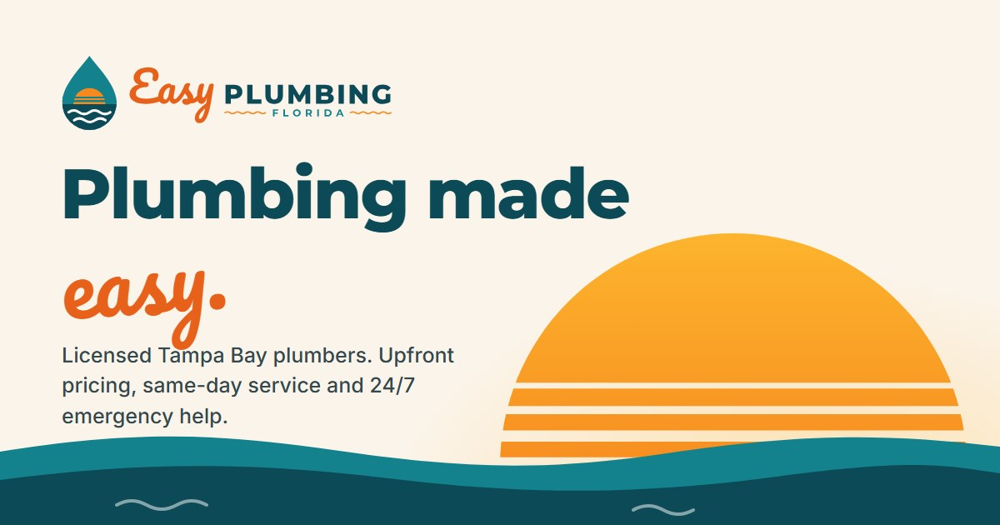

# Easy Plumbing FL

Marketing website for a Florida plumbing company, built as a portfolio piece: logo, brand palette and a one-page site. Plain HTML, CSS and JavaScript, no build step and no dependencies.



## The brand

"Sunshine Coast": a Florida sunset set inside a water drop. Water for the trade, sun and surf for the state. The same scene is reused across the site, most visibly as the striped sun that sets behind the hero's quote form.

| Colour | Hex | Used for |
| --- | --- | --- |
| Deep Teal | `#0B4A56` | Headings, dark sections |
| Gulf Teal | `#13828D` | Brand accents, icons |
| Sunset | `#E8611A` | Logo script, display text |
| Sunset 600 | `#CF4711` | Buttons (4.6:1 with white text) |
| Citrus | `#F68A1F` | Sun, small accents |
| Gold | `#FDB42D` | Highlights on dark |
| Sand | `#FBF4EA` | Light sections |

Type: **Pacifico** for script accents, **Montserrat** ExtraBold for headings, **Inter** for body text.

Logo text is converted to vector outlines, so `images/logo.svg` renders identically anywhere, including as an `` and without the fonts installed.

## Running it

```bash
python build.py
```

That renders `dist/`. Point Live Server (or any static server) at `dist/index.html`.
Re-run it after editing a template or the content file. No dependencies: the build
is standard-library Python only.

## Structure

```
templates/index.html  the page: hero, services, process, about, reviews, areas, FAQ
content/site.json     the text the client edits: phone, services, reviews, areas, FAQ
build.py              tiny renderer, fills the template from the content file
.pages.yml            field definitions for the client's editor (Pages CMS)
css/styles.css        tokens → base → layout → components → sections
js/main.js            mobile menu, scroll reveal, active nav link, quote form
images/               logo, favicons, social share image
brand/                logo concept sheet from the exploration round
dist/                 build output, not committed
```

The nav links jump to sections on the one page; there are no separate subpages.

## Who edits what

Design and layout live in `templates/` and `css/`. Everything a client would want to
change — phone number, hours, service area, the service list, reviews, FAQ, search
listing — lives in `content/site.json` and is edited through [Pages CMS](https://pagescms.org),
which commits to this repo and triggers a Netlify rebuild. Editors invited by email
don't need a GitHub account.

## About the content

The business name is real; everything else is placeholder copy for the demo. The phone number, email, reviews, ratings, job counts and claims such as "licensed & insured" are invented and should be replaced before this is used as a live business site. The quote form validates and shows a confirmation, but sends nothing: there's a marked spot in `js/main.js` for connecting a form service.
